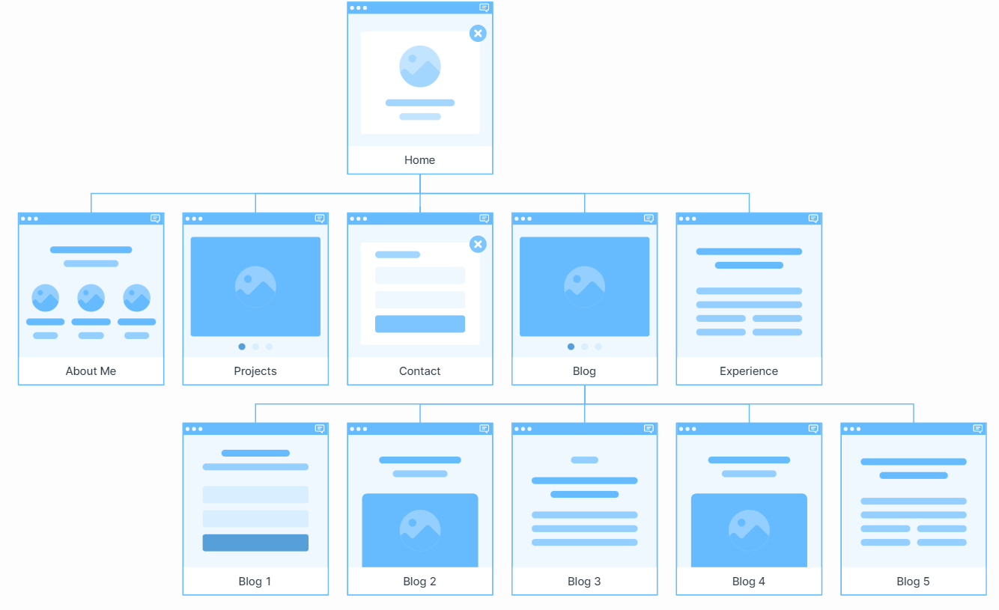
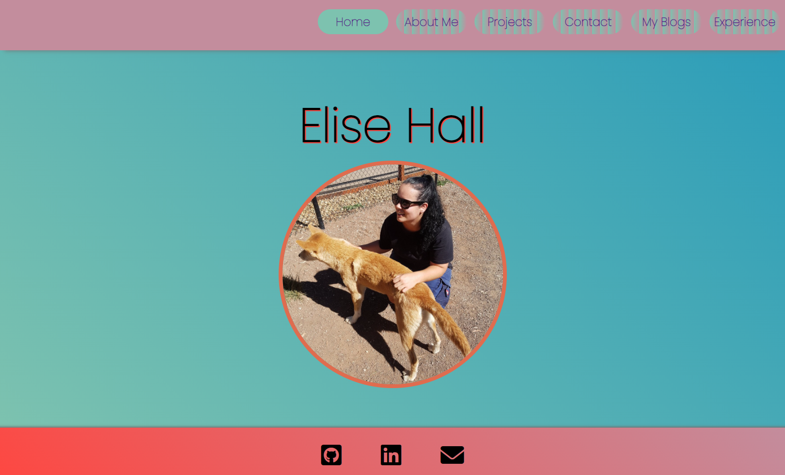
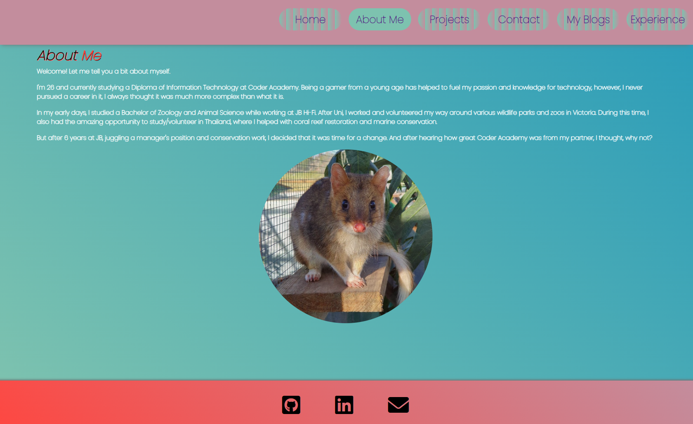
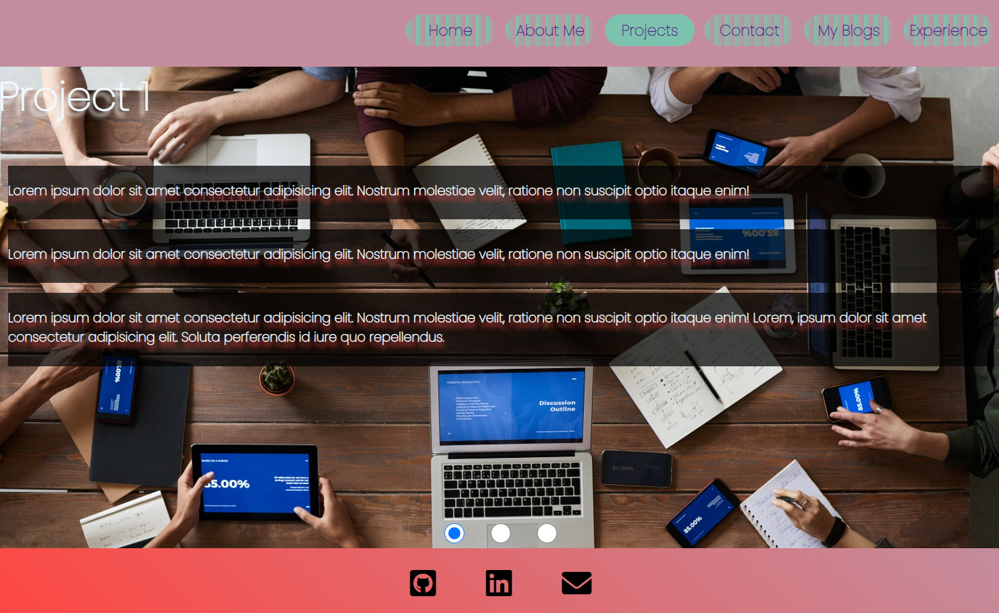
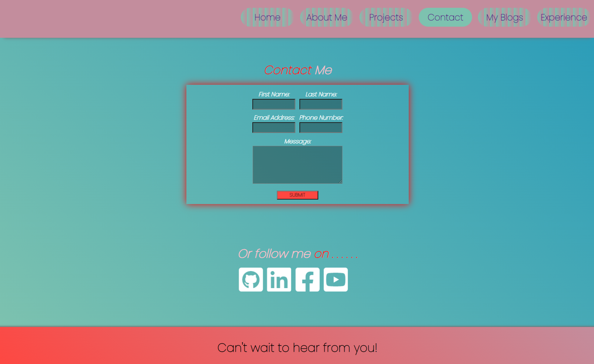
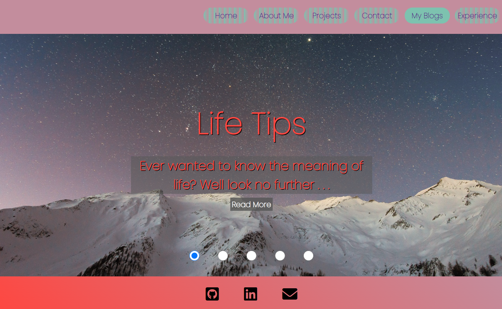
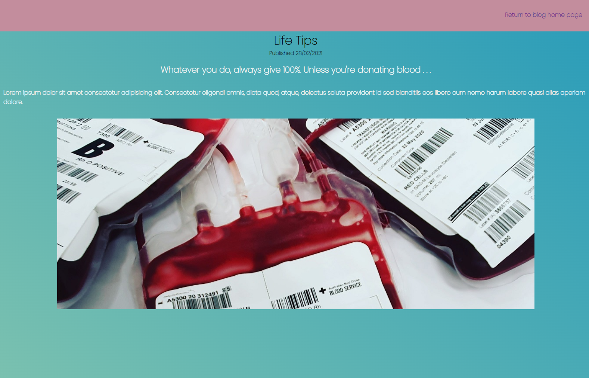
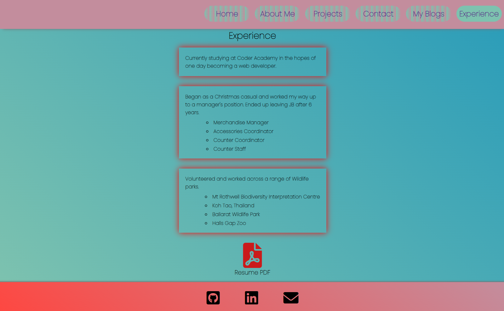
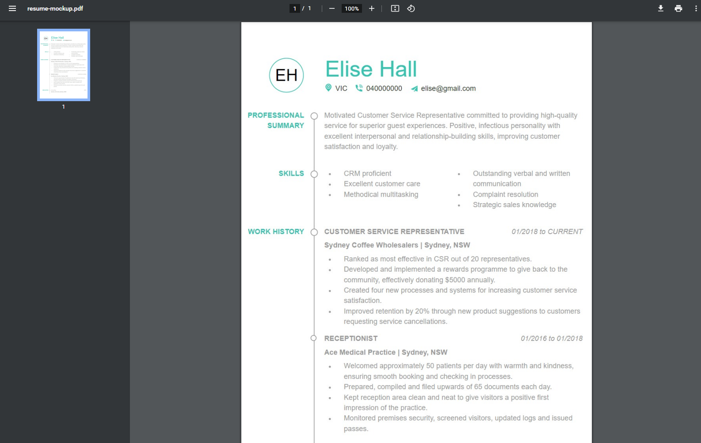

# T1A2 - Portfolio
[github repo](https://github.com/ehall28/html-portfolio)

[Netlify Link](https://elise-hall.netlify.app/index.html)
## Purpose 
The purpose of this website is to showcase my skills as an aspiring web developer and promote myself with the use of a resume and projects. 

## Features
The overall layout of the portfolio is designed to be simple and eye catching, but easy to navigate, all while capturing a glimpse of my personality through bright colour choices.
- Homepage: Contains a central image of myself, allows the user to put a face to the name.
- About me: A small blurb about myself and my achievements, with a small slideshow of images at the bottom; showcasing some of my experiences.
- Projects: Uses a carousel style slider layout for any future employers to flip through my projects with ease.
- Contact: Utilises a submit form for ease of contact, while also showing emphasis to 'follow me' and my work on various social links.
- Blogs: Uses a carousel style slider with a link to blogs I've written (currently contains placeholder text).
- Experience: Small description of past experiences with a convenient PDF link to my resume at the bottom.

## Site Map

Each page links together with a navbar at the top. 5 blog posts are accessible from the blog page.

## Screenshots

### Homepage

### About Me

### Projects

### Contact 

### My Blogs

#### Sample Blog Post

### Experience

#### Resume PDF Link

## Target Audience
The target audience is for prospective employers. The site is also responsive for mobile, tablet and desktop to allow for a multi use audience. 

## Tech Stack
Made with HTML and CSS only. Site will be refreshed and updated when I learn more. 

Hosted on Netlify.